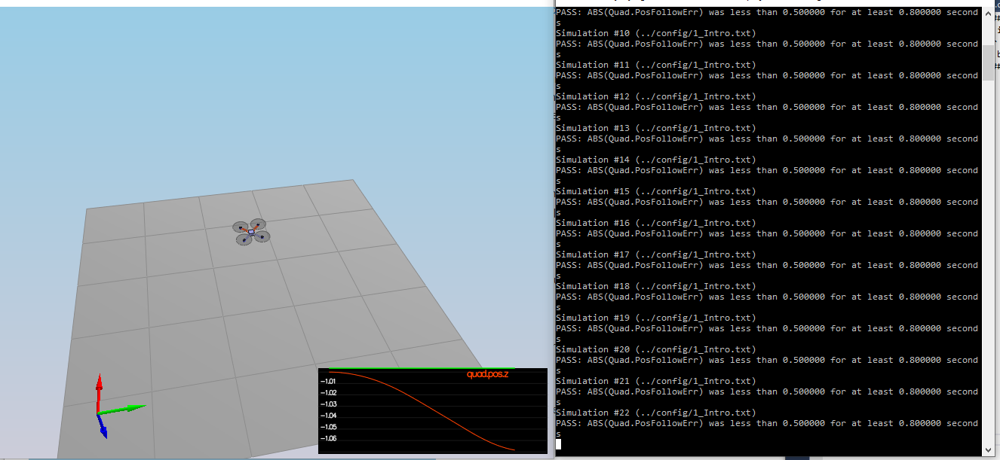
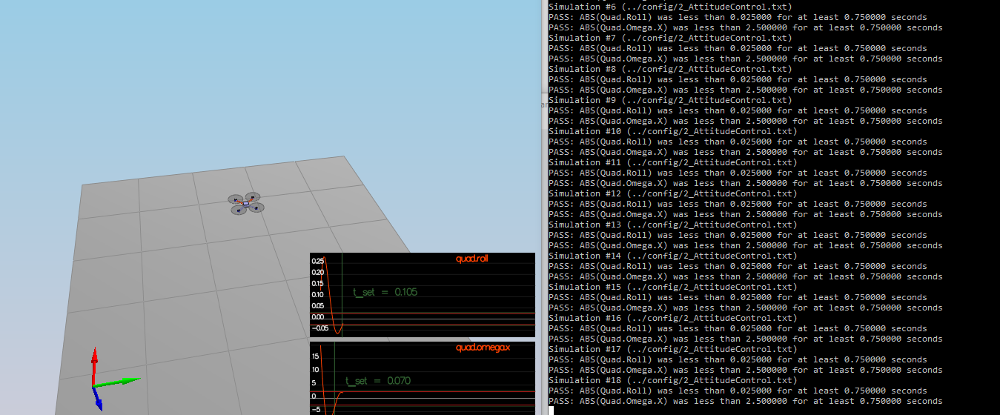
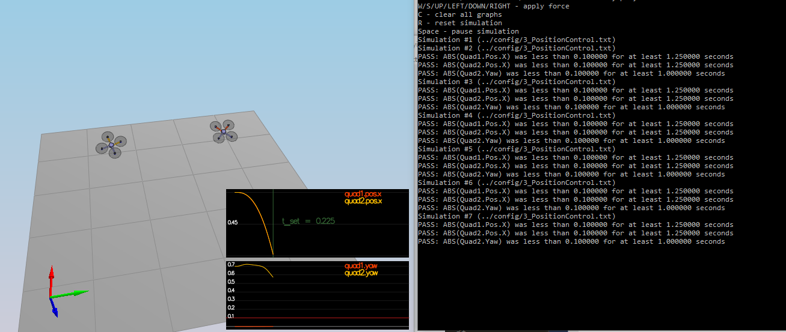
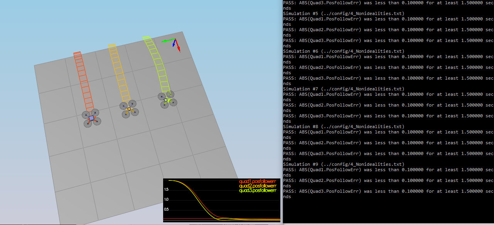
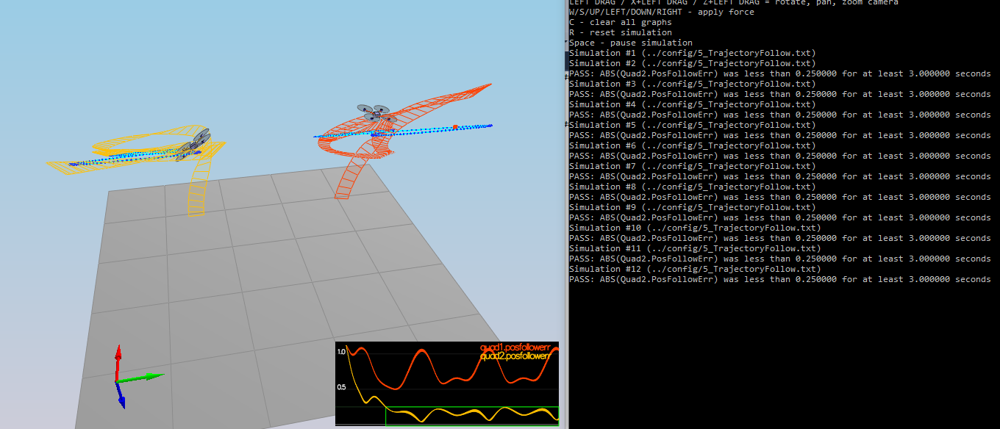

## FCND-Controls

### Introduction (scenario 1) ###

Tune the Mass Parameter in [/config/QuadControlParams.txt](./config/QuadControlParams.txt) to make the vehicle more or less stay in the same spot.

### Body rate and roll/pitch control (scenario 2) ###

Implement body rate and roll / pitch control. In this scenario, you will see a quad above the origin.  It is created with a small initial rotation speed about its roll axis.  The controller need to stabilize the rotational motion and bring the vehicle back to level attitude.

1. Implement body rate control

 - implement the code in the function `GenerateMotorCommands()`
 - implement the code in the function `BodyRateControl()`
 - Tune `kpPQR` in `QuadControlParams.txt` to get the vehicle to stop spinning quickly but not overshoot

2. Implement roll / pitch control

 - implement the code in the function `RollPitchControl()`
 - Tune `kpBank` in `QuadControlParams.txt` to minimize settling time but avoid too much overshoot

### Position/velocity and yaw angle control (scenario 3) ###

Implement the position, altitude and yaw control for your quad. In This Scenario, it will create 2 identical quads, one offset from its target point (but initialized with yaw = 0) and second offset from target point but yaw = 45 degrees.

 - implement the code in the function `LateralPositionControl()`
 - implement the code in the function `AltitudeControl()`
 - tune parameters `kpPosZ` and `kpPosZ`
 - tune parameters `kpVelXY` and `kpVelZ`
 - implement the code in the function `YawControl()`
 - tune parameters `kpYaw` and the 3rd (z) component of `kpPQR`

### Non-idealities and robustness (scenario 4) ###

In this part, we will explore some of the non-idealities and robustness of a controller.  In This Scenario, it is using a configuration with 3 quads that are all are trying to move one meter forward.  However, this time, these quads are all a bit different:
 - The green quad has its center of mass shifted back
 - The orange vehicle is an ideal quad
 - The red vehicle is heavier than usual

### Tracking trajectories (scenario 5) ###

In this scenario, it has two quadcopters:

 - the orange one is following `traj/FigureEight.txt`
 - the other one is following `traj/FigureEightFF.txt` - for now this is the same trajectory.

