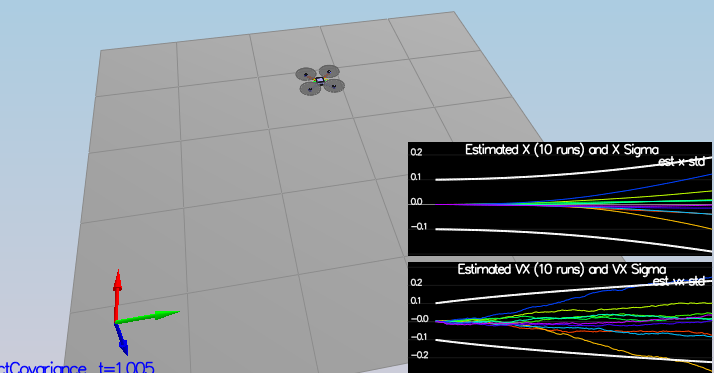

## Estimation Project

 In this project, The estimation portion of the controller will be developed and used in the CPP simulator.

### Step 1: Sensor Noise

For the first step, some simulated noisy sensor data will be collected, and the standard deviation of the quad's sensor will be estimated.

From config/log/Graph1.txt, the standard deviation for GPS X data was found to be 0.71279. And from config/log/Graph2.txt, the standard deviation for Accelerometer X data was found to be 0.487971.

### Step 2: Attitude Estimation

Improving the complementary filter-type attitude filter with a better rate gyro attitude integration scheme. To be Successful, the attitude estimator needs to get within 0.1 rad for each of the Euler angles for at least 3 seconds.

<pre>
  Quaternion<float> qt = Quaternion<float>().FromEuler123_RPY(rollEst, pitchEst, ekfState(6));
  qt.IntegrateBodyRate(gyro, dtIMU);

  float predictedRoll = qt.Roll();
  float predictedPitch = qt.Pitch();
  ekfState(6) = qt.Yaw();

  // normalize yaw to -pi .. pi
  if (ekfState(6) > F_PI) ekfState(6) -= 2.f*F_PI;
  if (ekfState(6) < -F_PI) ekfState(6) += 2.f*F_PI;
</pre>

### Step 3: Prediction Step

Implement the state prediction step.

<pre>
  Quaternion<float> attitude = Quaternion<float>::FromEuler123_RPY(rollEst, pitchEst, curState(6));

  ////////////////////////////// BEGIN STUDENT CODE ///////////////////////////
  //rotate the acceleration from body frame to inertial frame
  V3F accel_inertial = attitude.Rotate_BtoI(accel);

  predictedState(0) += predictedState(3)*dt; //x
  predictedState(1) += predictedState(4)*dt; //y
  predictedState(2) += predictedState(5)*dt; //z

  predictedState(3) += accel_inertial.x * dt; //vx
  predictedState(4) += accel_inertial.y * dt; //vy
  predictedState(5) += (accel_inertial.z - static_cast<float>(CONST_GRAVITY) )* dt;
</pre>

Implements the GetRbgPrice and Prediction step, and tune the QPosXYStd and QVelXYStd process parameters in QuadEstimatorEKF.txt.

<pre>
  gPrime(0, 3) = dt;
  gPrime(1, 4) = dt;
  gPrime(2, 5) = dt;

  VectorXf a(3, 1);
  a << accel.x, accel.y, accel.z;

  VectorXf gPrime_row(3);
  gPrime_row = RbgPrime * a * dt;
  gPrime(3, 6) = gPrime_row(0);
  gPrime(4, 6) = gPrime_row(1);
  gPrime(5, 6) = gPrime_row(2);

  ekfCov = gPrime * ekfCov * gPrime.transpose() + Q;
</pre>

### Step 4: Magnetometer Update

Tune the parameter QYawStd (QuadEstimatorEKF.txt) for the QuadEstimatorEKF so that it approximately captures the magnitude of the drift.

<pre>
  hPrime(0, 6) = 1.0f;
  zFromX(0) = ekfState(6);

  float delta = magYaw - ekfState(6);
  if (delta > F_PI)
    zFromX(0) += 2.0f * F_PI;
  else if (delta < -F_PI)
    zFromX(0) -= 2.0f *F_PI;
</pre>      

### Step 5: Closed Loop + GPS Update

Implement the EKF GPS Update in the function UpdateFromGPS().

<pre>
  hPrime.topLeftCorner(6, 6) = MatrixXf::Identity(6, 6);
  for (int i = 0; i < 6; ++i)
    zFromX(i) = ekfState(i);
</pre>

### Step 6: Adding Your Controller

Replace the QuadController.cpp with the controller from last project.

